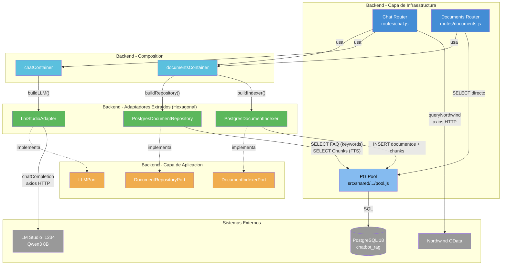

# Diagrama de Componentes del Backend (C4 L3)

El backend Express está en migración progresiva hacia **Arquitectura Hexagonal (Puertos y Adaptadores)** vía patrón Strangler Fig.

## Estado actual (Slices 1-3 completados)

Los puertos `DocumentRepositoryPort`, `DocumentIndexerPort` y `LLMPort` han sido extraídos. El backend legacy en `db/` se ha reducido a solo `schema.sql`.

| Componente | Archivo | Capa | Responsabilidad |
|-----------|---------|------|----------------|
| Chat Router | `routes/chat.js` | Inbound Adapter (legacy) | Orquesta el flujo de consulta: decideAction, validacion, queryNorthwind, buildContext, generateReply |
| Documents Router | `routes/documents.js` | Inbound Adapter (legacy) | CRUD documental: indexado, busqueda y recuperacion de documentos |
| PG Pool | `db/pool.js` / `src/shared/adapters/outbound/postgres/pool.js` | Compartido | Pool de conexiones PostgreSQL (max 5, timeout 30s) |
| **DocumentRepositoryPort** | `src/features/documents/application/ports/outbound/DocumentRepositoryPort.js` | **Application (Puerto)** | Contrato de busqueda documental: search, searchFAQ, searchChunks |
| **DocumentIndexerPort** | `src/features/documents/application/ports/outbound/DocumentIndexerPort.js` | **Application (Puerto)** | Contrato de indexación: indexDocument, indexDirectory |
| **LLMPort** | `src/features/chat/application/ports/outbound/LLMPort.js` | **Application (Puerto)** | Contrato de inferencia LLM: chatCompletion |
| **PostgresDocumentRepository** | `src/features/documents/adapters/outbound/postgres/PostgresDocumentRepository.js` | **Infrastructure (Adaptador)** | Busqueda en cascada: FAQ (keywords array) → Chunks (FTS espanol) |
| **PostgresDocumentIndexer** | `src/features/documents/adapters/outbound/postgres/PostgresDocumentIndexer.js` | **Infrastructure (Adaptador)** | Parseo, chunking y persistencia de documentos |
| **LmStudioAdapter** | `src/features/chat/adapters/outbound/lmstudio/LmStudioAdapter.js` | **Infrastructure (Adaptador)** | Cliente HTTP para API compatible OpenAI de LM Studio |
| **documentsContainer** | `src/features/documents/composition/documentsContainer.js` | **Composition Root** | Wiring de repositorio + indexador |
| **chatContainer** | `src/features/chat/composition/chatContainer.js` | **Composition Root** | Wiring del LLM |

> **Nota:** Verde = hexagonal extraído. Azul oscuro = legacy. Este diagrama se actualiza con cada slice completado.

