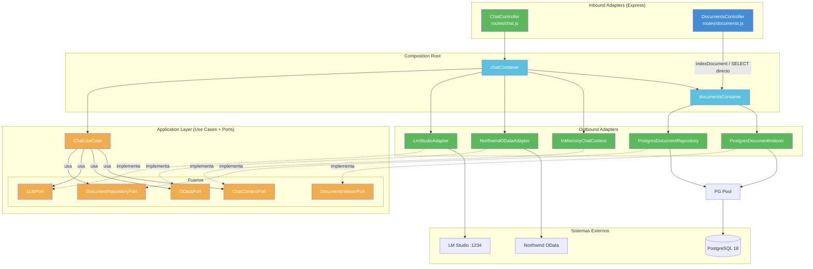

# Diagrama de Componentes del Backend (C4 L3)

El backend Express está en migración progresiva hacia **Arquitectura Hexagonal (Puertos y Adaptadores)** vía patrón Strangler Fig.

## Estado actual (Slices 1-4 completados — migración completa)

Todos los puertos y adaptadores han sido extraídos. El backend legacy en `db/` solo contiene `schema.sql`. `routes/chat.js` es un inbound adapter delgado (~25 líneas) que delega toda la orquestación en `ChatUseCase`.

| Componente | Archivo | Capa | Responsabilidad |
|-----------|---------|------|----------------|
| Chat Router | `routes/chat.js` | **Inbound Adapter** | Parsea HTTP Request → llama a ChatUseCase → responde JSON |
| Documents Router | `routes/documents.js` | Inbound Adapter (legacy) | CRUD documental: indexado, busqueda y recuperacion |
| PG Pool | `db/pool.js` / `src/shared/adapters/outbound/postgres/pool.js` | Compartido | Pool de conexiones PostgreSQL (max 5, timeout 30s) |
| **DocumentRepositoryPort** | `src/features/documents/application/ports/outbound/DocumentRepositoryPort.js` | **Application (Puerto)** | Contrato de busqueda documental: search, searchFAQ, searchChunks |
| **DocumentIndexerPort** | `src/features/documents/application/ports/outbound/DocumentIndexerPort.js` | **Application (Puerto)** | Contrato de indexación: indexDocument, indexDirectory |
| **LLMPort** | `src/features/chat/application/ports/outbound/LLMPort.js` | **Application (Puerto)** | Contrato de inferencia LLM: chatCompletion |
| **ODataPort** | `src/features/chat/application/ports/outbound/ODataPort.js` | **Application (Puerto)** | Contrato de consultas OData (Northwind / SAP S/4HANA) |
| **ChatContextPort** | `src/features/chat/application/ports/outbound/ChatContextPort.js` | **Application (Puerto)** | Contrato de contexto conversacional |
| **ChatUseCase** | `src/features/chat/application/use-cases/ChatUseCase.js` | **Application (Caso de uso)** | Orquestación completa: decideAction, validacion, query, generateReply |
| **PostgresDocumentRepository** | `src/features/documents/adapters/outbound/postgres/PostgresDocumentRepository.js` | **Infrastructure (Adaptador)** | Busqueda en cascada: FAQ → Chunks FTS |
| **PostgresDocumentIndexer** | `src/features/documents/adapters/outbound/postgres/PostgresDocumentIndexer.js` | **Infrastructure (Adaptador)** | Parseo, chunking y persistencia |
| **LmStudioAdapter** | `src/features/chat/adapters/outbound/lmstudio/LmStudioAdapter.js` | **Infrastructure (Adaptador)** | Cliente HTTP para LM Studio |
| **NorthwindODataAdapter** | `src/features/chat/adapters/outbound/northwind/NorthwindODataAdapter.js` | **Infrastructure (Adaptador)** | Cliente HTTP para Northwind OData + config ALLOWED |
| **InMemoryChatContext** | `src/features/chat/adapters/outbound/memory/InMemoryChatContext.js` | **Infrastructure (Adaptador)** | Contexto conversacional en memoria |
| **documentsContainer** | `src/features/documents/composition/documentsContainer.js` | **Composition Root** | Wiring documental |
| **chatContainer** | `src/features/chat/composition/chatContainer.js` | **Composition Root** | Wiring del chat + LLM + OData + contexto |

> **Nota:** Verde = inbound/outbound adapters. Naranja = aplicación/puertos. Azul claro = composition. La migración hexagonal está completa.

