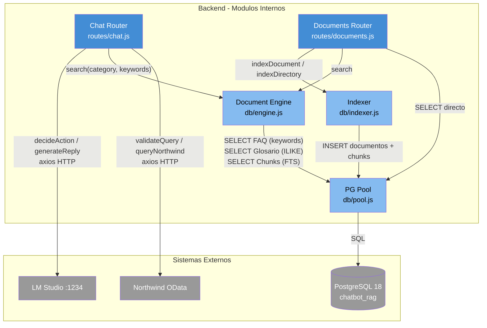

# Diagrama de Componentes del Backend (C4 L3)

El backend Express se compone de seis modulos internos que se comunican entre si y con los sistemas externos.

| Componente | Archivo | Responsabilidad |
|-----------|---------|----------------|
| Chat Router | `routes/chat.js` | Orquesta el flujo completo de consulta: decideAction, validacion, queryNorthwind, buildContext, generateReply |
| Documents Router | `routes/documents.js` | CRUD documental: indexado, busqueda y recuperacion de documentos |
| Document Engine | `db/engine.js` | Busqueda en cascada: FAQ (keywords array) → Glosario (ILIKE) → Chunks (FTS espanol) |
| Indexer | `db/indexer.js` | Parseo de Markdown/JSON/TXT, extraccion de frontmatter, chunking de 800 palabras |
| PG Pool | `db/pool.js` | Pool de conexiones PostgreSQL (max 5, timeout 30s) |
| LM Client | (axios en chat.js) | Cliente HTTP para API compatible OpenAI de LM Studio |

