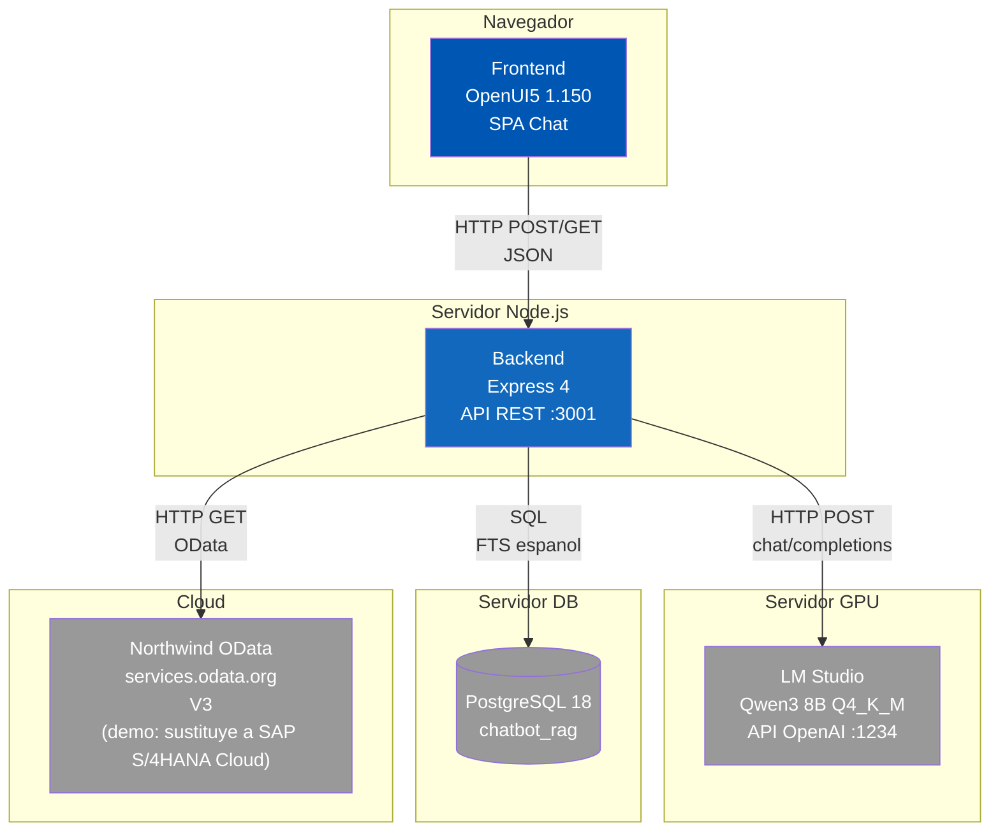

# Diagrama de Contenedores (C4 L2)

El sistema se compone de dos contenedores principales (Frontend y Backend) y tres sistemas externos.

**Frontend (OpenUI5 1.150):**
- SPA tipo chat con burbujas de usuario (derecha) y asistente (izquierda)
- Botones dinamicos generados por el LLM con estados visuales (activo: Emphasized, seleccionado: Accept, deshabilitado: Default)
- Renderizado diferenciado para fragmentos documentales (borde naranja, cabecera)
- Envia historial de ultimos 6 mensajes en cada request (configurable via CHAT_HISTORY_LIMIT)
- Sin dependencias externas ni API keys

**Backend (Node.js 22 + Express 4):**
- API REST en puerto 3001
- Clasifica intencion via LLM: query, reply, document_query, continuation, unknown
- Valida consultas contra schema definido (entidades, filtros, expand)
- Ejecuta busqueda documental en cascada: FAQ → Chunks (FTS)
- Cache en memoria lastContext para continuacion de conversacion

