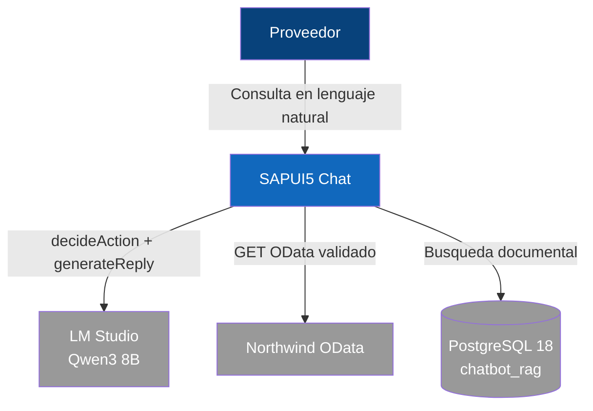

# Diagrama de Contexto (C4 L1)

El sistema **SAPUI5 Chat** es un asistente conversacional que permite a proveedores consultar datos de negocio (facturas, pedidos, clientes) y documentacion corporativa (FAQ, manuales) mediante lenguaje natural.

El sistema se integra con tres sistemas externos:
- **LM Studio** — inferencia local del LLM (Qwen3 8B) para clasificar intenciones y generar respuestas
- **Northwind OData** — API externa con datos de negocio (solo consulta)
- **PostgreSQL 18** — base de datos documental con busqueda de texto completo en espanol

