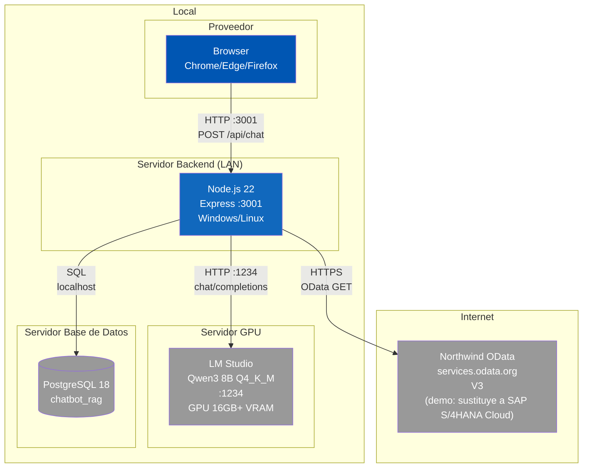

# Diagrama de Despliegue (C4 L4)

El sistema se despliega en un entorno local con cuatro nodos fisicos/logicos mas el acceso del proveedor via browser.

| Nodo | Tecnologia | Detalle |
|------|-----------|---------|
| Dispositivo Proveedor | Browser | Chrome/Edge/Firefox, acceso HTTP a Frontend |
| Servidor Backend | Node.js 22 | Express en puerto 3001, comunicacion con LM Studio (localhost:1234) |
| Servidor GPU | LM Studio | GPU 16GB+ VRAM, Qwen3 8B Q4_K_M, contexto 32K tokens |
| Servidor DB | PostgreSQL 18 | Base de datos chatbot_rag, FTS espanol |
| Cloud | Northwind OData | API externa services.odata.org, solo GET. Sustituye a SAP S/4HANA Cloud (demo) |

