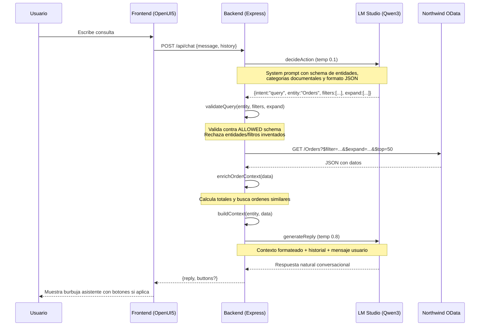

# Diagrama de Secuencia: Consulta de Datos (Query)

Flujo completo cuando un proveedor consulta datos de negocio (ej: "Cual es la orden 10248?").

```mermaid
sequenceDiagram
    participant U as Usuario
    participant FE as Frontend (OpenUI5)
    participant BE as Backend (Express)
    participant LLM as LM Studio (Qwen3)
    participant NW as Northwind OData

    U->>FE: Escribe consulta
    FE->>BE: POST /api/chat {message, history}
    BE->>LLM: decideAction (temp 0.1)
    Note over BE,LLM: System prompt con schema de entidades,<br/>categorias documentales y formato JSON
    LLM-->>BE: {intent:"query", entity:"Orders", filters:[...], expand:[...]}
    BE->>BE: validateQuery(entity, filters, expand)
    Note over BE: Valida contra ALLOWED schema<br/>Rechaza entidades/filtros inventados
    BE->>NW: GET /Orders?$filter=...&$expand=...&$top=50
    NW-->>BE: JSON con datos
    BE->>BE: enrichOrderContext(data)
    Note over BE: Calcula totales y busca ordenes similares
    BE->>BE: buildContext(entity, data)
    BE->>LLM: generateReply (temp 0.8)
    Note over BE,LLM: Contexto formateado + historial + mensaje usuario
    LLM-->>BE: Respuesta natural conversacional
    BE-->>FE: {reply, buttons?}
    FE-->>U: Muestra burbuja asistente con botones si aplica
```
