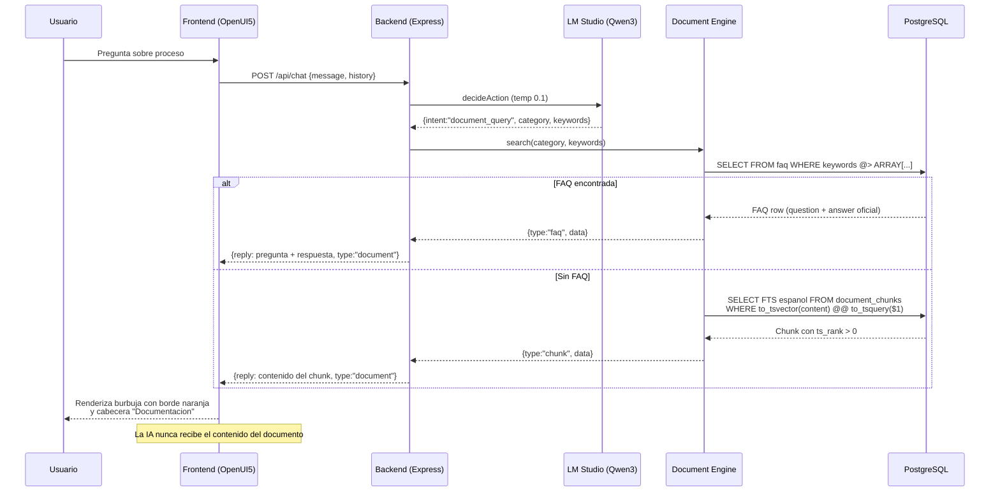

# Diagrama de Secuencia: Consulta Documental RAG

Flujo completo cuando un proveedor pregunta sobre procesos internos (ej: "Como registro una factura?").

El LLM solo clasifica la intencion — nunca recibe el contenido del documento.

