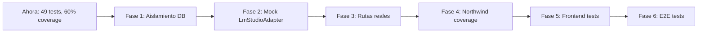

# Evaluación de Testing: Estado Actual y Mejoras

> Documento de contexto — Julio 2026

## Resumen

49 tests, 8 archivos, 3 skills registrados. Cobertura general 60% (statements).
La base es sólida: Vitest + supertest + DB real con arquitectura hexagonal.
Hay brechas en aislamiento, cobertura de rutas reales y tests de integración HTTP.

---

## 1. Lo que funciona bien

| Aspecto | Detalle |
|---------|---------|
| Framework | Vitest v4 + supertest + @vitest/coverage-v8 — moderno, rápido, sin bloat |
| Use case tests | POJOs con `vi.fn()` para puertos — patrón correcto en hexagonal |
| DB real tests | 13 tests que ejercitan PostgreSQL FTS, `@>` array, INSERT/SELECT reales |
| Route tests | Inline Express builder evade correctamente la limitación `vi.mock` + CJS |
| Limpieza | `try/finally` en tests de indexación de archivos |
| Skills | `testing-backend`, `testing-frontend`, `testing-e2e` registrados en AGENT.md |

---

## 2. Problemas críticos

### 2.1 DB compartida sin aislamiento entre workers

**Contexto:** Los test files `PostgresDocumentRepository.test.js` y `PostgresDocumentIndexer.test.js` corren en workers paralelos de Vitest. Ambos escriben y leen de `chatbot_rag_test`. El `beforeAll` TRUNCATE reduce la ventana pero no la elimina: si el worker A ejecuta su `beforeAll` mientras el worker B está en medio de un test, los datos de B desaparecen.

**Impacto:** Fallos intermitentes. Aparecen solo bajo carga (CI, máquinas lentas, muchos workers).

**Mejora:** Una de:
- Pool de bases de datos por worker: `chatbot_rag_test_{workerId}` creada en `globalSetup`
- `--pool forks` con `singleFork` o `fileParallelism: false` para DB tests
- Ejecución secuencial: `pnpm vitest run --sequence.concurrent=false`

### 2.2 Cobertura de rutas reales en 0%

**Contexto:** Los tests HTTP usan `buildTestApp()` que duplica inline la lógica de `routes/chat.js` y `routes/documents.js`. Si alguien modifica las rutas reales (agrega un middleware, cambia un status code), los tests existentes no fallan.

**Impacto:** Falsos positivos — tests verdes con rutas rotas.

**Mejora:** Cargar el server real con `vi.mock()` sobre el pool y los containers para aislar solo la capa HTTP. Requiere solución para `vi.mock` + CJS (ej. usar `async-dependencies` o migrar a ESM en los imports de ruta).

### 2.3 LmStudioAdapter tests dependen de conexión real

**Contexto:** Los tests de `LmStudioAdapter.chatCompletion()` apuntan a `http://127.0.0.1:1` y capturan el error de conexión. El comportamiento varía por OS y entorno (ECONNREFUSED, ETIMEDOUT, ENOTFOUND, o success si algo escucha en ese puerto).

**Impacto:** Tests frágiles, no deterministas.

**Mejora:** Usar `vi.mock("axios")` para simular respuestas HTTP sin conexión real:

```js
vi.mock("axios");
const axios = require("axios");
axios.post.mockResolvedValue({ data: { choices: [{ message: { content: "ok" } }] } });
```

Esto requiere que `vi.mock` funcione con CJS en vitest v4. Alternativa: inyectar axios como dependencia del adapter.

---

## 3. Problemas moderados

### 3.1 NorthwindODataAdapter: 33% de cobertura

Solo `getSchema()` y `getSchemaDescription()` están probados. `query()`, `findSimilarOrders()`, `buildFilterParams()`, `calcTotal()` no tienen tests. `query()` y `findSimilarOrders()` hacen HTTP real — deberían mockearse con `vi.mock("axios")`.

### 3.2 Líneas no cubiertas en documentos

| Archivo | Líneas | Riesgo |
|---------|--------|--------|
| `PostgresDocumentIndexer.js:13-18` | `parsers.json` — parseo de arrays JSON | Si el formato cambia, rompe sin test |
| `PostgresDocumentIndexer.js:54-55` | Push de chunk en splitChunks | Condición de borde con chunks exactos |
| `PostgresDocumentIndexer.js:126` | `console.error` en indexDirectory | Error silencioso en indexación |
| `PostgresDocumentRepository.js:4,29` | Guard `if (!keywords)` y category filter | Early return no verificado |

### 3.3 Ruido en stdout durante tests

`console.log("=== RAW LLM ===", ...)` y `console.error("JSON parse error:...")` aparecen en ejecución normal. En CI, esto entierra señales de error reales.

**Mejora:** Usar `vi.spyOn(console, "log").mockImplementation(() => {})` en tests o mover logs a un logger que se calle en test (`process.env.NODE_ENV === "test"`).

### 3.4 Sin tests de autenticación en rutas

Las rutas no tienen middleware de auth actualmente, pero cuando se agregue, no habrá test que valide el rechazo de requests sin token.

---

## 4. Problemas menores

| Issue | Detalle |
|-------|---------|
| Credenciales hardcodeadas en setup | Fallback `chatbot_user:chatbot_pass_2026` debería ser solo env var |
| Schema errors silenciados | `.catch(() => {})` en setup esconde errores de migración |
| Sin separación unit/integration | `pnpm test` corre todo junto. Útil tener `test:unit` y `test:integration` |
| ChatUseCase 69% cobertura | Líneas 91-193 y 198-229 no cubiertas (enrichOrderContext, buildContext ramas) |
| Sin frontend tests | Solo skill, 0 archivos de test en webapp/test/ |
| Sin E2E tests | Solo skill, 0 archivos en e2e/ |

---

## 5. Plan de mejora recomendado



| Fase | Acción | Archivos |
|------|--------|----------|
| 1 | DB por worker o secuencial | `vitest.config.js` |
| 2 | Mock axios en LmStudioAdapter | `LmStudioAdapter.test.js` |
| 3 | Cargar server real con mocking | `chat.test.js`, `documents.test.js` |
| 4 | Tests de query/findSimilarOrders | `NorthwindODataAdapter.test.js` |
| 5 | QUnit + OPA5 en webapp/test/ | `frontend/webapp/test/` |
| 6 | Playwright contra full stack | `e2e/specs/` |

---

## 6. Estado vs. mejores prácticas modernas

| Práctica | Estado | Nota |
|----------|--------|------|
| Aislamiento de tests | ❌ | DB compartida, workers paralelos |
| Mocks sin IO real | ⚠️ | LmStudioAdapter OK parcial, Northwind no mockeado |
| Cobertura de rutas reales | ❌ | Inline builders, no routes reales |
| Tests deterministas | ⚠️ | LmStudioAdapter frágil, DB races |
| Separación unit/integration | ❌ | Un solo comando |
| Frontend testing | ❌ | 0 tests |
| E2E testing | ❌ | 0 tests |
| Silent tests (sin console noise) | ❌ | RAW LLM logs en stdout |
| Cleanup en fallos | ⚠️ | try/finally suficiente, temp files en source dir |
| CI pipeline | ❌ | No existe |
