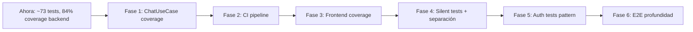

# Evaluación de Testing: Estado Actual y Mejoras

> Documento de contexto — Julio 2026
> Última actualización: 2026-07-12 — Refleja el estado real del proyecto

## Resumen

~73 tests, 21 archivos, 3 skills registrados. Backend 84% cobertura (statements), 62% (branches).
La base es sólida: Vitest + supertest + DB real con arquitectura hexagonal.
Frontend tiene QUnit + OPA5 funcionando. E2E tiene Playwright.
Hay brechas en profundidad de cobertura, aislamiento e integración continua.

---

## 1. Lo que funciona bien

| Aspecto | Detalle |
|---------|---------|
| Framework backend | Vitest v4 + supertest + @vitest/coverage-v8 — moderno, rápido, sin bloat |
| Use case tests | POJOs con `vi.fn()` para puertos — patrón correcto en hexagonal |
| DB real tests | 14 tests que ejercitan PostgreSQL FTS, `@>` array, INSERT/SELECT reales |
| Route tests | Mock de containers via `require.cache` para aislar la capa HTTP |
| Limpieza en tests de archivos | `try/finally` consistente en PostgresDocumentIndexer |
| Mocks HTTP | NorthwindODataAdapter y LmStudioAdapter usan axios mockeado (sin IO real) |
| Frontend unitario | App.controller con 9 tests que cubren onInit, onSend, onLiveChange, itemFactory, _buildHistory |
| Frontend integración | OPA5 journey con page object + mock fetch para pruebas de UI sin backend real |
| E2E | Playwright con webServer configurado para backend + frontend automático |
| Skills | `testing-backend`, `testing-frontend`, `testing-e2e` registrados en AGENT.md con patrones completos |
| Ejecución paralela | `pnpm test` corre backend + frontend en paralelo, `pnpm test:all` incluye E2E |

---

## 2. Problemas críticos

### 2.1 ChatUseCase con solo 69% de cobertura

**Contexto:** El use case principal tiene 13 tests pero las ramas de `enrichOrderContext` (líneas 91-193) y `buildContext` (líneas 198-229) no están cubiertas. Esto incluye lógica de enriquecimiento de órdenes y reconstrucción de contexto multi-turno.

**Impacto:** Cambios en la lógica central del chatbot no tienen protección de regresión.

**Mejora:** Tests específicos para `enrichOrderContext` con órdenes con múltiples detalles, descuentos, clientes con diferentes datos, y para `buildContext` con historial variable.

### 2.2 Sin CI pipeline

**Contexto:** No existe `.github/workflows/`, `Jenkinsfile`, ni ningún pipeline de CI. Los tests solo se ejecutan localmente.

**Impacto:** No hay garantía de que los tests pasen antes de mergear cambios. No hay gatekeeping de calidad.

**Mejora:** GitHub Actions con:
- Push/PR: `pnpm install-all` → `pnpm test:backend` → `pnpm test:frontend`
- Nightly: `pnpm test:all` (incluye E2E)
- Coverage: subir reporte a Codecov o similar

### 2.3 Sin medición de cobertura en frontend

**Contexto:** Karma/QUnit no genera reportes de cobertura. No se sabe qué porcentaje del frontend está cubierto.

**Mejora:** Migrar a `ui5-test-runner` (soporta coverage con Istanbul) o agregar `karma-coverage`.

---

## 3. Problemas moderados

### 3.1 Ruido en stdout durante tests

`console.log("=== RAW LLM ===", ...)` y `console.error("JSON parse error:...")` aparecen en ejecución normal. En CI, esto entierra señales de error reales.

**Mejora:** Usar `vi.spyOn(console, "log").mockImplementation(() => {})` en tests o mover logs de LLM a un logger que se calle en test (`process.env.NODE_ENV === "test"`).

### 3.2 Sin tests de autenticación en rutas

Las rutas no tienen middleware de auth actualmente, pero cuando se agregue, no habrá test que valide el rechazo de requests sin token.

### 3.3 ChatUseCase — cobertura branch baja

| Rama | Cobertura | Riesgo |
|------|-----------|--------|
| `enrichOrderContext` | 0% | Enriquecimiento de órdenes con Customer, Order_Details, cálculo de totales |
| `buildContext` | 0% | Reconstrucción de historial multi-turno desde el contexto en memoria |
| Manejo de errores de parseo JSON | Parcial | Solo cubierto el caso de texto plano; falta JSON parcialmente malformado |

### 3.4 Sin separación unit/integration

`pnpm test` corre todo junto. Útil tener `test:unit` (solo use cases, adapters sin DB) y `test:integration` (DB real, HTTP).

---

## 4. Problemas menores

| Issue | Detalle |
|-------|---------|
| Credenciales hardcodeadas en setup | Fallback `chatbot_user:chatbot_pass_2026` debería ser solo env var |
| Schema errors silenciados | `.catch(() => {})` en setup esconde errores de migración |
| E2E frágil | Selectores SAPUI5 auto-generados (`[id$='--chatInput']`) pueden romperse con cambios de versión o refactor de vistas |
| Karma legacy | `karma-ui5` funciona pero `ui5-test-runner` es el estándar actual de UI5 Tooling |
| LmStudioAdapter patrón mixto | Usa inyección de dependencia en vez de `vi.mock("axios")` — funcional pero menos idiomático |
| Frontend tests trivials | Util.helper solo verifica que `showBusy`/`hideBusy` existen; WelcomeOptions solo verifica estructura de array |
| testsuite.qunit no incluye todos los tests | `integrationTests.qunit.html/js` no existen separados; la integración se carga desde el mismo HTML de unit |

---

## 5. Plan de mejora recomendado

| Fase | Acción | Archivos |
|------|--------|----------|
| 1 | Tests para `enrichOrderContext` y `buildContext` | `ChatUseCase.test.js` |
| 2 | GitHub Actions workflow (push + PR + nightly) | `.github/workflows/` |
| 3 | ui5-test-runner con coverage Istanbul | `frontend/karma.conf.js` → `ui5-test-runner` |
| 4 | Silenciar logs LLM en tests + separar scripts | `vitest.setup.js`, `package.json` |
| 5 | Agregar test pattern para auth cuando se implemente middleware | `routes/__tests__/chat.test.js` |
| 6 | E2E: seed DB, enviar mensaje y verificar respuesta | `e2e/specs/` |

---

## 6. Estado vs. mejores prácticas modernas

| Práctica | Estado | Nota |
|----------|--------|------|
| Aislamiento de tests | ⚠️ | `fileParallelism: false` evita races, pero tests comparten misma DB |
| Mocks sin IO real | ✅ | Todos los adapters HTTP y DB están mockeados o usan DB de test |
| Cobertura de ramas en use cases | ❌ | ChatUseCase branches al 69%, ramas críticas sin cubrir |
| Tests deterministas | ✅ | Mocks eliminaron dependencia de LM Studio real |
| Separación unit/integration | ❌ | Un solo comando, sin distinción |
| Frontend testing | ✅ | 15 tests QUnit + OPA5 funcionando |
| Frontend coverage | ❌ | No medido |
| E2E testing | ✅ | 2 tests Playwright con webServer configurado |
| E2E profundidad | ⚠️ | Solo page load + button enable; falta flujo completo |
| Silent tests (sin console noise) | ❌ | RAW LLM logs en stdout |
| Cleanup en fallos | ✅ | try/finally en tests de archivos |
| CI pipeline | ❌ | No existe |
| Documentación de testing viva | ⚠️ | Evaluation doc actualizada; falta guía de estrategia |

---

## 7. Inventario completo de archivos de test

### Backend (Vitest + supertest) — 10 archivos

| Archivo | Tests | Tipo |
|---------|-------|------|
| `chat/use-cases/__tests__/ChatUseCase.test.js` | 13 | Unit (mocks puros) |
| `chat/adapters/outbound/lmstudio/__tests__/LmStudioAdapter.test.js` | 2 | Unit (axios mockeado) |
| `chat/adapters/outbound/memory/__tests__/InMemoryChatContext.test.js` | 3 | Unit (estado) |
| `chat/adapters/outbound/northwind/__tests__/NorthwindODataAdapter.test.js` | 11 | Unit + HTTP mockeado |
| `documents/adapters/outbound/postgres/__tests__/PostgresDocumentRepository.test.js` | 8 | Integración (DB real) |
| `documents/adapters/outbound/postgres/__tests__/PostgresDocumentIndexer.test.js` | 6 | Integración (DB real + archivos) |
| `routes/__tests__/chat.test.js` | 5 | HTTP (supertest + container mock) |
| `routes/__tests__/documents.test.js` | 8 | HTTP (supertest + container mock) |
| `vitest.config.js` | — | Config |
| `vitest.setup.js` | — | Setup DB |

### Frontend (QUnit + OPA5 via Karma) — 7 archivos

| Archivo | Tests | Tipo |
|---------|-------|------|
| `test/unit/controller/App.controller.js` | 9 | Unit (QUnit) |
| `test/unit/model/models.js` | 1 | Unit (QUnit) |
| `test/unit/helper/Util.helper.js` | 1 | Unit (QUnit) |
| `test/unit/config/WelcomeOptions.js` | 2 | Unit (QUnit) |
| `test/integration/App.journey.js` | 2 | Integración (OPA5) |
| `test/integration/pages/App.page.js` | — | Page Object (soporte) |
| `test/testsuite.qunit.js` | — | Registro de suites |

### E2E (Playwright) — 1 archivo

| Archivo | Tests | Tipo |
|---------|-------|------|
| `specs/app.spec.js` | 2 | E2E (navegador real) |
